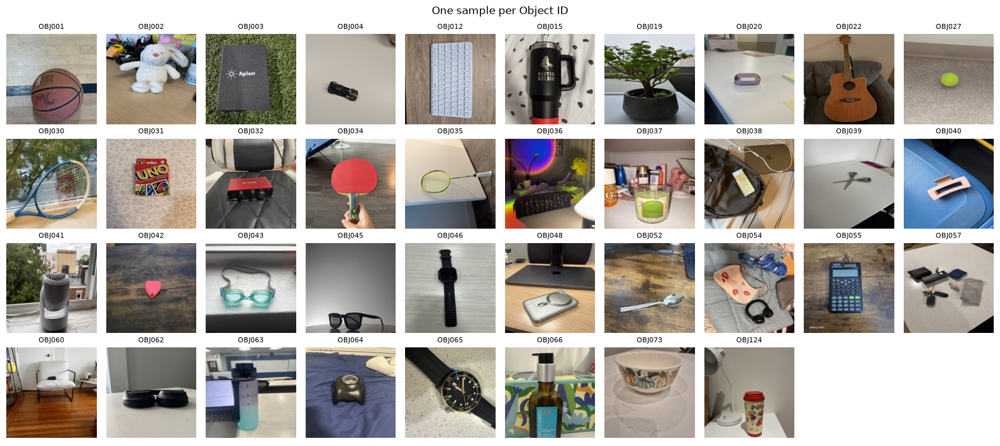
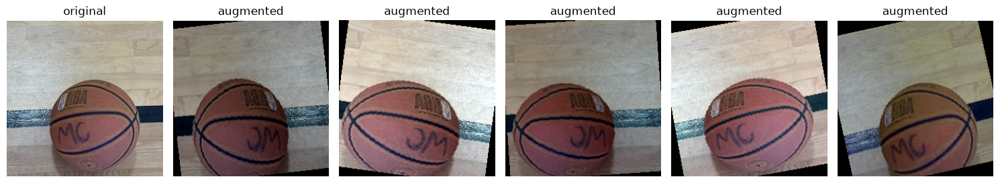
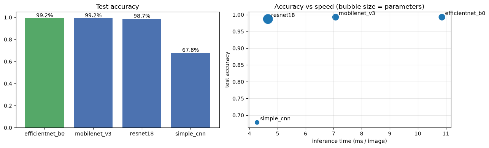
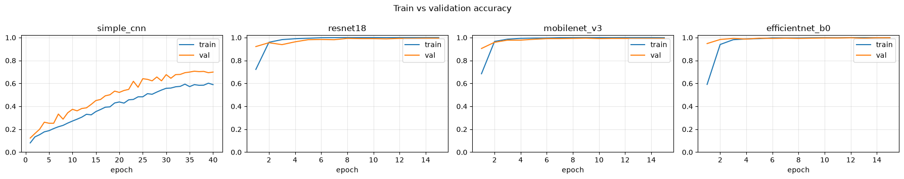
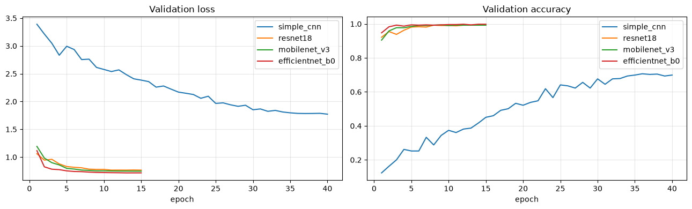
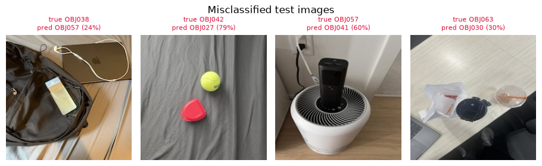
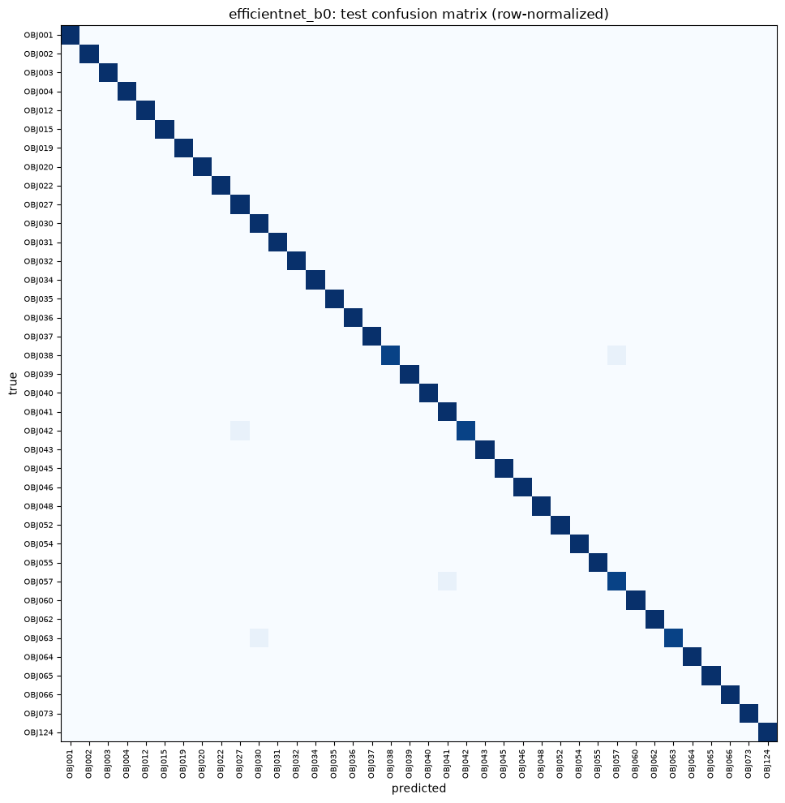

# Project Report – Object Identification (Milestone 1)

**Northeastern University · IE 7615 – Discriminative Deep Learning · Fall 2026 · October 4, 2026**

**Group 1**

| Name | NUID |
|---|---|
| Anshuman Singh | 002590892 |
| Rohan Prakash Krishna Prakash | 002317798 |
| Sree Ramya Pasala | 002301508 |

PDF version: [Milestone1_Report.pdf](Milestone1_Report.pdf)

## Repository

GitHub: <https://github.com/anshuman-dataverse/discriminative-deep-learning-project>

Code, data, trained models and results are in the milestone1/ folder of the repository. This report covers the experimental setup, results, analysis and conclusions.

## Update (October 7, 2026): retrained on all 73 classes

This report was submitted on October 4 with the 38 classes uploaded at that time. After the full shared-Drive download with the final Object IDs became available, all four models were retrained on the same pipeline: 73 classes, 6,942 images, stratified 70/15/15 split (4,886 / 1,028 / 1,028). Matching the two downloads by image fingerprint showed that two first-upload IDs had changed: the folder uploaded as OBJ124 is final **OBJ011**, and the folder uploaded as OBJ002 is final **OBJ021**.

| **Model** | **Val acc.** | **Test acc.** | **Top-5** | **Macro F1** | **Params** | **ms/img** |
|----|----|----|----|----|----|----|
| EfficientNet-B0 | 98.74% | 98.35% | 100.00% | 0.983 | 4.10M | 10.2 |
| MobileNetV3-Large | 98.25% | 97.96% | 99.90% | 0.980 | 4.30M | 8.3 |
| ResNet18 | 98.35% | 97.86% | 99.81% | 0.979 | 11.21M | 4.4 |
| SimpleCNN (scratch) | 63.52% | 64.98% | 86.77% | 0.624 | 1.19M | 3.7 |

EfficientNet-B0 remains the best model. It misclassifies 17 of 1,028 test images; 13 of the 17 are low-confidence guesses (below 0.6). The hardest classes are OBJ013 (F1 0.83), OBJ059 and OBJ061 (0.88, mostly confused with each other) and OBJ041 (0.88, confused with OBJ048); their photos are often wide scenes where the object is small. The retrained models are the ones used in the live demo (https://ie7615-group1-object-detection.vercel.app). The sections below are the original 38-class report.

## 1. Summary

We built and compared four convolutional neural networks that identify which of **38 objects** appears in a 224×224 photo. Three ImageNet-pretrained networks fine-tuned with transfer learning all reached about 99% accuracy on held-out test images. A CNN trained from scratch reached only 67.85%.

**Recommended model: EfficientNet-B0.** It scored 99.25% test accuracy with macro F1 0.993, getting only 4 of 535 test images wrong, using 4.06M parameters and 10.9 ms per image. MobileNetV3-Large is tied on accuracy and is faster, which makes it a strong alternative for a real-time demo. All four remaining mistakes are cluttered photos that also contain a different student's object, a case that Milestone 2's multi-object detection is designed to handle.

## 2. Objective

The project builds a deep learning system that (1) identifies the object in a single-object image by its Object ID, and (2) detects, identifies and locates every object in a multi-object image. Milestone 1 covers the dataset and part (1): build and test several CNN models, evaluate and compare them, and select the best model for the demonstration.

## 3. Dataset

### 3.1 Collection

Each student photographed one unique physical object: 95 object photos plus 5 background-only photos. The shot plan required at least 3 backgrounds, 2 lighting conditions, 3 distances (close, medium and far) and some cluttered scenes. Every image was to be 224×224 RGB JPEG, named OBJ###\_###.jpg, and uploaded to a shared Drive folder images_OBJ###.

At the time of this report, **38 students** had uploaded (the class has 73), giving 3,809 raw files.

### 3.2 Data quality issues and cleaning

We audited every folder before training. The uploads were not uniform:

| **Issue found** | **Folders** | **Fix** |
|----|----|----|
| Full-resolution 16128×16128 photos (never resized) | OBJ022 | Decoded at reduced size, resized to 224×224 |
| Wrong size (183×244, 224×192) | OBJ057, OBJ003 (1 image) | Resized to 224×224 |
| Folder misnamed (image\_, image\_\_OBJ124\_, images\_\_OBJ034\_) | OBJ054, OBJ124, OBJ034 | Object ID parsed from folder name |
| Files misnamed (purse_001.jpg, iWatch_001.jpg, OBJ060_1.JPG) | OBJ054, OBJ046, OBJ060 | Renamed to OBJ###\_###.jpg |
| No background photos / extra photos | OBJ004, OBJ012 / OBJ124, OBJ063 | Kept; all object photos used |
| Stray files (.DS_Store, settings.local.json) | OBJ036, OBJ040 | Ignored |
| Duplicate photos (incl. object photos reused as backgrounds) | 11 files, e.g. OBJ065 | Removed to prevent train/test leakage |

After cleaning, every image is 224×224 RGB JPEG, with orientation corrected from the photo's EXIF data. Background-only images (181) are **excluded** from the classifier because they are not an object class; they are kept for Milestone 2 detection.

### 3.3 Train / validation / test split

The split is **stratified**: each object is divided 70/15/15 on its own, so every class appears in all three sets in the same proportions. The split is saved once and reused, so every model is trained and tested on identical images. The test set is never used for any training decision.

| **Set**    | **Images** | **Per class** | **Used for**                            |
|------------|------------|---------------|-----------------------------------------|
| Train      | 2549       | ≈ 67          | Fitting the weights                     |
| Validation | 535        | ≈ 14          | Choosing the best epoch, early stopping |
| Test       | 535        | ≈ 14          | Final, one-time evaluation              |
| Total      | 3619       | ≈ 95          | 38 classes                              |

*Figure 1. One sample image for each of the 38 Object IDs.*

## 4. Method

### 4.1 Preprocessing and augmentation

With only about 67 training images per class, augmentation is essential to reduce overfitting. Each training image is randomly cropped (70–100% of its area), horizontally flipped, rotated up to ±15° and color-jittered (brightness, contrast, saturation, hue). These changes imitate the angle and lighting variety in the shot plan. Validation and test images are only resized. All images are normalized with ImageNet mean and standard deviation.

*Figure 2. One training image and five random augmentations of it.*

### 4.2 Models tested

| **Model** | **Type** | **Architecture** | **Params** |
|----|----|----|----|
| SimpleCNN | From scratch (baseline) | 4 conv blocks \[2× (3×3 conv, BatchNorm, ReLU), max-pool\], channels 32→64→128→256; global average pool; dropout 0.3; linear | 1.18M |
| ResNet18 | Transfer learning | 18-layer residual network, ImageNet-pretrained; final layer replaced by a 38-way linear layer | 11.2M |
| MobileNetV3-Large | Transfer learning | Depthwise-separable inverted residuals with squeeze-excite, built for mobile; new 38-way head | 4.25M |
| EfficientNet-B0 | Transfer learning | Compound-scaled MBConv network; new 38-way head | 4.06M |

For the three pretrained models, the whole network is fine-tuned (not only the new head) with a small learning rate. The scratch CNN is the baseline. It shows how much of the performance comes from pretraining rather than from this dataset alone.

### 4.3 Training setup

| **Setting** | **Value** |
|----|----|
| Optimizer | AdamW, weight decay 1e-4 |
| Learning rate | 1e-3 (SimpleCNN); 3e-4 (pretrained), with a cosine schedule |
| Epochs | 40 (SimpleCNN); 15 (pretrained) |
| Loss | Cross-entropy with label smoothing 0.1 |
| Batch size | 32 |
| Early stopping | Stop after 6 epochs without validation improvement; keep the best-validation checkpoint |
| Hardware | Apple M4, PyTorch 2.14 (MPS GPU backend) |

## 5. Results

### 5.1 Model comparison

All metrics are measured on the 535 held-out test images. Macro precision, recall and F1 average the per-class scores, so every object counts equally. Inference time is for one image at batch size 1, as in a live demo.

Val acc. is the best validation accuracy, used to pick each model's checkpoint; all other columns are on the test set.

| **Model** | **Val acc.** | **Test acc.** | **Top-5** | **Macro P** | **Macro R** | **Macro F1** | **ms/img** | **Train** |
|----|----|----|----|----|----|----|----|----|
| EfficientNet-B0 | 99.81% | 99.25% | 99.81% | 0.993 | 0.993 | 0.993 | 10.9 | 12.0 min |
| MobileNetV3-Large | 99.44% | 99.25% | 99.63% | 0.993 | 0.993 | 0.992 | 7.1 | 7.7 min |
| ResNet18 | 99.44% | 98.69% | 99.63% | 0.988 | 0.987 | 0.987 | 4.7 | 8.4 min |
| SimpleCNN (scratch) | 70.65% | 67.85% | 92.52% | 0.691 | 0.678 | 0.664 | 4.3 | 25.7 min |

*Figure 3. Test accuracy (left), and accuracy against inference time (right; bubble size = parameters).*

### 5.2 Training behavior

The pretrained models reach over 95% validation accuracy within 2–3 epochs and finish with train and validation accuracy close together, so there is little overfitting. The scratch CNN learns slowly: after 40 epochs it reaches about 59% training accuracy and 70.65% validation accuracy. It is under-fitting, because about 67 images per class are too few to learn good visual features from nothing.

*Figure 4. Train and validation accuracy per epoch for each model.*

*Figure 5. Validation loss and accuracy of all four models.*

## 6. Error analysis

### 6.1 Best model (EfficientNet-B0)

Only 4 of 535 test images are misclassified. Looking at them shows a clear pattern: **every error is a cluttered scene that contains another class's object.**

- **OBJ042** predicted as **OBJ027**: the photo also contains a tennis ball, which is OBJ027's object.

- **OBJ057** predicted as **OBJ041**: the object is photographed on top of an air purifier, which is OBJ041's object.

- **OBJ038** predicted as **OBJ057** and **OBJ063** predicted as **OBJ030**: busy scenes (a bag and laptop; a desk with several items) where the model has low confidence (24% and 30%).

These are ambiguous inputs rather than model failures: a classifier that outputs a single label cannot be fully correct when two dataset objects are in the frame. Milestone 2's detector can find and label each object separately.

*Figure 6. The four misclassified test images (true label, prediction and confidence).*

*Figure 7. EfficientNet-B0 test confusion matrix (row-normalized). The near-perfect diagonal shows very few confusions.*

### 6.2 Hardest classes

Lowest per-class F1 for the best model, and the same classes for the scratch baseline:

| **Object ID** | **EfficientNet-B0 F1** | **SimpleCNN F1** |
|---------------|------------------------|------------------|
| OBJ057        | 0.929                  | 0.400            |
| OBJ038        | 0.963                  | 0.261            |
| OBJ042        | 0.963                  | 0.364            |
| OBJ063        | 0.963                  | 0.720            |
| OBJ027        | 0.966                  | 0.769            |

The baseline's weakest classes (OBJ038, OBJ062, OBJ042, OBJ034, OBJ052; F1 0.26–0.40) are all identified almost perfectly by EfficientNet-B0 (F1 ≥ 0.96). The classes the scratch model cannot separate are handled almost perfectly once the model starts from pretrained ImageNet features.

## 7. Best model selection

We select **EfficientNet-B0** as the best model for this dataset and the Milestone 1 demonstration:

- **Highest accuracy:** 99.25% test accuracy and the highest macro F1 (0.993); its top-5 accuracy is 99.81%.

- **Compact:** 4.06M parameters, about a third of ResNet18's size.

- **Fast enough:** 10.9 ms per image, far below what an interactive demo needs.

**Alternative:** MobileNetV3-Large gets the same number of test images right (macro F1 0.992) and runs about 35% faster (7.1 ms). The gap between the two is one image's worth of F1, which is within noise, so MobileNetV3 is a reasonable choice if speed matters more.

## 8. Limitations and next steps

- **Small test set:** about 14 test images per class, so one mistake moves a class's F1 by about 0.04. The differences among the top three models (3 or fewer images) are not statistically significant. Repeated runs with different seeds, or cross-validation, would tighten these estimates.

- **Partial dataset:** results cover the 38 objects uploaded so far, out of 73 students. More classes, especially visually similar ones (several bottles, earbuds or chargers), will likely reduce accuracy. The pipeline re-runs unchanged on the full dataset.

- **Optimistic test images:** test photos were taken by the same student in the same sessions as the training photos. Accuracy on new photos taken elsewhere will likely be lower.

- **Single-label limitation:** cluttered photos that contain several dataset objects cannot be classified correctly by design. **Next (Milestone 2):** build multi-object images by concatenating single-object images, and fine-tune a pretrained YOLOv8 detector to identify and locate every object.

## 9. Conclusion

Milestone 1 delivers a working single-object identification pipeline for the class dataset. Four CNNs were trained and tested on the same stratified split. EfficientNet-B0 is the best model, with 99.25% test accuracy and macro F1 0.993, and it is the model used for the demonstration.

**Key takeaways:**

- **Transfer learning is decisive:** the three ImageNet-pretrained models reach about 99% accuracy, while the same data trains a CNN from scratch to only 67.85%.

- **A compact model is enough:** EfficientNet-B0 (4.06M parameters) and MobileNetV3-Large (4.25M) match or beat the larger ResNet18 (11.2M).

- **Cleaning the shared uploads mattered:** resizing, renaming and removing duplicate photos kept the test score honest.

- **Next step:** the remaining errors are photos that contain two dataset objects, which motivates Milestone 2 (YOLOv8 multi-object detection and localization).

## 10. Deliverables and reproducibility

| **File** | **Purpose** |
|----|----|
| data/{train,val,test}/OBJ###/ | Cleaned, deduplicated dataset split 70/15/15 (2,549 / 535 / 535 images) |
| scripts/01_data_inspection.py | Audit the raw Drive download (counts, sizes, names, stray files) |
| scripts/02_split_data.py | Clean, resize and deduplicate the images; write the stratified split |
| scripts/03_train_models.py | Train the four models with early stopping |
| scripts/04_evaluate_models.py | Compare the models and select the best |
| scripts/05_predict.py | Identify new photos: python scripts/05_predict.py photo.jpg |
| notebooks/01–03 | The same pipeline step by step, with error analysis and the live demo |
| models/\<Model\>.pt | Trained weights (best validation epoch) |
| results/ | Per-model classification report, training history and confusion matrix; model comparison |

Run the scripts from milestone1/ in order (01 to 04), or the three notebooks. Models that are already trained are skipped by notebook 02 unless RETRAIN = True. A full retrain takes about 55 minutes on an Apple M4.
