# Project Report – Object Detection and Location (Milestone 2)

**Northeastern University · IE 7615 – Discriminative Deep Learning · Fall 2026 · October 7, 2026**

**Group 1**

| Name | NUID |
|---|---|
| Anshuman Singh | 002590892 |
| Rohan Prakash Krishna Prakash | 002317798 |
| Sree Ramya Pasala | 002301508 |

PDF version: [Milestone2_Report.pdf](Milestone2_Report.pdf)

## Repository

GitHub: <https://github.com/anshuman-dataverse/discriminative-deep-learning-project>

Code, data, trained model and results are in the milestone2/ folder of the repository. This report explains how the multi-object images and labels were built, reports the detector's performance, and shows example detections.

## 1. Summary

We generated **1,700 multi-object images** (1,200 train / 250 validation / 250 test) by pasting randomly selected single-object photos from the full class dataset (**73 objects, final Object IDs**) onto background photos, with labels written automatically. Three layouts are used: photos scattered with gaps, photos concatenated into a grid, and packed collages where photos touch or overlap slightly. No source image appears in more than one split. We then fine-tuned a COCO-pretrained **YOLOv8s** detector on these images with transfer learning.

On the 250 held-out test images (941 objects) the detector reaches **mAP@0.5 = 0.981** and **mAP@0.5:0.95 = 0.978**. At a confidence threshold of 0.5, **94.4% of all objects** are found with the correct Object ID and location, there are **no false alarms**, and **80.4% of test images** have every object detected and identified. Inference takes about 3.6 ms per image.

## 2. Objective

Given an image that contains several objects, the model must report the **Object ID and location** of every object. The milestone requires (1) at least 100 multi-object images built by combining randomly selected single-object images, with no source image in more than one split, (2) a YOLOv8 model trained to detect the objects, and (3) a model that outputs the ID and bounding box of each object in a test image.

## 3. Single-object source data

### 3.1 Final dataset and Object IDs

We used the complete shared Drive folder downloaded on October 7, 2026: 73 folders named images_OBJ001 to images_OBJ073, matching the final Object IDs in the shared sheet, with 7,343 images in total.

While checking the download against the 38-class Milestone 1 data, we matched every old folder to its new one by image fingerprint. Two Milestone 1 labels had changed to their final IDs: the folder uploaded as **OBJ124** is final **OBJ011**, and the folder uploaded as **OBJ002** is final **OBJ021** (final OBJ002 is a different object). Milestone 2 uses only the final IDs.

### 3.2 Cleaning and split

The images were cleaned with the Milestone 1 pipeline: EXIF orientation applied, resized to 224×224 RGB, renamed OBJ###\_###.jpg, and near-duplicate photos removed (28 removed, none shared between two objects). The object photos were then split **70/15/15 per class**. Background-only photos were kept separately and split 70/15/15 in the same way.

| **Set** | **Object photos** | **Background photos** | **Used to build** |
|----|----|----|----|
| Train | 4,886 | 261 | Training images |
| Validation | 1,028 | 56 | Validation images |
| Test | 1,028 | 56 | Test images |
| Total | 6,942 | 373 | 73 classes |

## 4. Building the multi-object images and labels

### 4.1 Composition

Each multi-object image is a 640×640 canvas built as follows (scripts/01_make_multi_object.py):

1. **Background:** a random background-only photo from the same split, resized to fill the canvas.
2. **Number of objects:** 2 to 6, chosen at random (average 3.8).
3. **Object selection:** objects are drawn from a shuffled queue that cycles through every class, so all 73 objects appear about equally often. No class appears twice in one image. Within a class, photos are drawn without replacement, so nearly every source photo is used once.
4. **Layout**, one of three:
   - **Scatter (50%):** each photo is resized to a random size between 130 and 300 px (30% also get a mild aspect-ratio change) and placed at a random position with a gap of at least 6 px to every other photo.
   - **Grid (25%):** the photos are concatenated into the cells of a 2×2 or 3×3 grid, the classic "concatenated images" layout.
   - **Collage (25%):** photos of 170 to 320 px are packed so that each one touches or overlaps another, with at most 12% of any photo covered. This teaches the detector to separate objects that are next to each other.
5. **Augmentation:** each pasted photo and the background are independently flipped horizontally (50%) and given random brightness, contrast and saturation changes (±30%).

### 4.2 Labels

Because the generator knows exactly where each photo was pasted, labels are written automatically, with no manual annotation. Each image gets a YOLO label file with one line per object:

    class_index  x_center  y_center  width  height     (all normalized to 0–1)

The class index maps to the Object ID through data.yaml (index 0 = OBJ001 … index 72 = OBJ073). A manifest file (data/multi/manifest.csv) records, for every pasted object, the composite image, split, layout, source photo, background photo, Object ID and box.

The bounding box covers the whole pasted photo. The source photos were taken with the object filling a varying part of the frame, so the box locates the photo that contains the object rather than the object's exact outline (see Section 8).

### 4.3 Split integrity and label validation

Train images are built only from training photos and training backgrounds, and likewise for validation and test. After generation, the script runs two checks and stops with an error if either fails:

- **No leakage:** every source and background photo used is checked, both by file path and by a near-duplicate image fingerprint. **0 photos** appear in more than one split.
- **Valid labels:** every image has a label file and vice versa, every image is 640×640, every line has 5 values, the class index is in range, and every box lies inside the image with positive size. **6,419 boxes in 1,700 images were checked, 0 invalid.**

| **Split** | **Images** | **Objects** | **Unique source photos** | **Min. objects per class** |
|----|----|----|----|----|
| Train | 1,200 | 4,508 | 4,508 | 61 |
| Validation | 250 | 970 | 969 | 13 |
| Test | 250 | 941 | 941 | 12 |
| Total | 1,700 | 6,419 | 6,418 | |

Layouts: 873 scatter, 423 grid and 404 collage images.

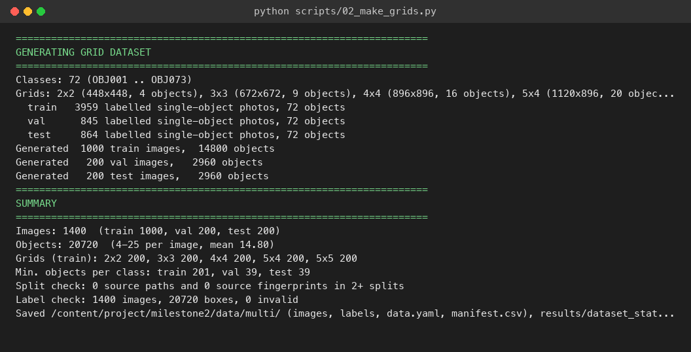

*Figure 1. Console output of the dataset generator, including the split and label checks.*

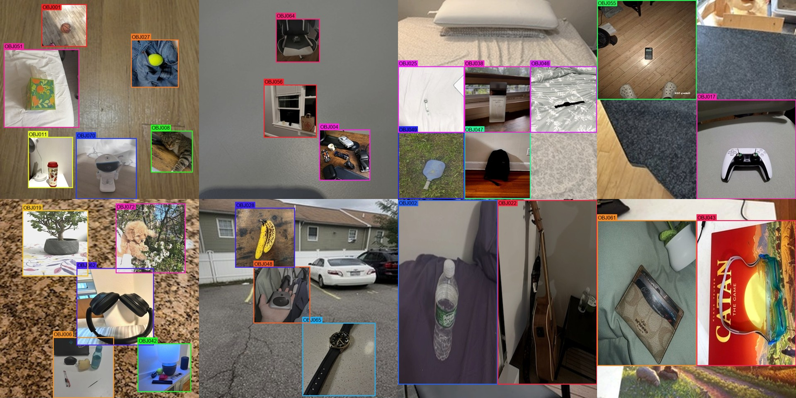

*Figure 2. Eight generated training images with their automatically generated labels: scatter (top left), grid and collage layouts.*

### 4.4 Label distribution

Every class has 61 or 62 training instances, so the training set is balanced across all 73 objects. Box centres are spread over the whole canvas (the bright points are the fixed cell centres of the grid layout), and box sizes range from about 0.2 to 0.5 of the image side, with square boxes dominating because most photos are pasted square.

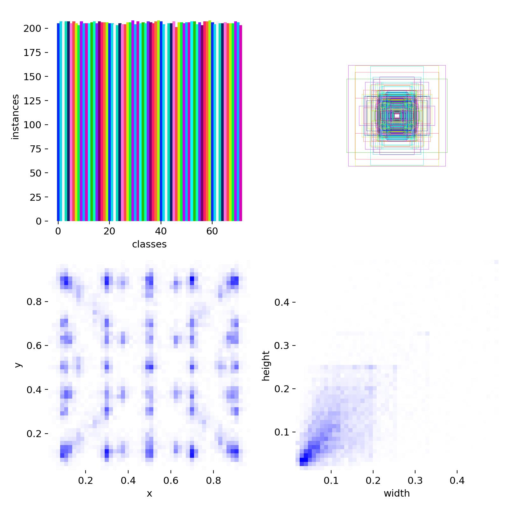

*Figure 3. Training label distribution: instances per class (top left), box shapes (top right), box centres (bottom left) and box width against height (bottom right).*

## 5. Model and training

### 5.1 YOLOv8s architecture

YOLOv8 is a one-stage detector: a convolutional backbone (CSPDarknet with C2f blocks) extracts features, a feature-pyramid neck combines them at three scales, and an anchor-free decoupled head predicts a box and class scores at every location. We used the small variant, YOLOv8s, which balances accuracy and speed.

| **Specification** | **Value** |
|----|----|
| Architecture | YOLOv8s (small) |
| Input resolution | 640 × 640 |
| Total parameters | 11,163,851 (11,153,835 after layer fusion) |
| GFLOPs | 28.6 (fused) |
| Layers | 129 (72 after fusion) |
| Detection heads | 3 scales (strides 8, 16, 32 for small, medium, large objects) |

### 5.2 Transfer learning

- **Pretrained weights:** COCO (80 classes), downloaded from Ultralytics (yolov8s.pt, 21.5 MB).
- **New head:** the 80-class head was replaced by a **73-class** head (Ultralytics: "Overriding model.yaml nc=80 with nc=73"). 349 of 355 weight tensors were transferred; the 6 that were not are the class-prediction layers sized for 80 classes.
- **Fine-tuning:** the whole network (11.2M parameters) is trained, starting from the pretrained features. Pretraining supplies general object and edge features, so the model learns our objects from about 61 training instances per class.

### 5.3 Training configuration

| **Parameter** | **Value** | **Parameter** | **Value** |
|----|----|----|----|
| Base model | yolov8s.pt | Early-stopping patience | 15 epochs |
| Epochs | 60 (ran all 60) | Device | Apple M4 GPU (MPS) |
| Batch size | 16 | Box loss gain | 7.5 |
| Image size | 640 | Classification loss gain | 0.5 |
| Optimizer | AdamW (auto) | DFL loss gain | 1.5 |
| Learning rate (initial) | 1.3e-4 (auto) | Warm-up | 3 epochs |
| Learning rate (final) | 0.01 × initial | IoU threshold (NMS) | 0.7 |
| Momentum | 0.9 | Weight decay | 0.0005 |
| Checkpoint | Best validation fitness | Training time | 2.1 hours |

### 5.4 Augmentation applied by YOLOv8

On top of our own composition augmentation (Section 4.1), Ultralytics applies these during training:

- **Mosaic:** combines 4 training images into one (probability 1.0), switched off for the last 10 epochs.
- **Horizontal flip:** 50% probability.
- **HSV colour shifts:** hue 0.015, saturation 0.7, value 0.4.
- **Random erasing:** 40% probability.
- **Scale and translation:** scale ±50%, translation ±10%.

At prediction time we use **class-agnostic non-maximum suppression**. Each location holds only one object, so when two boxes with different IDs overlap, only the more confident one is kept.

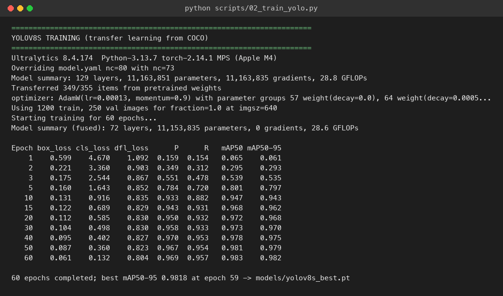

*Figure 4. Training console output: model summary, transfer of pretrained weights, optimizer, and losses and validation metrics at selected epochs.*

### 5.5 Training progression

| **Epoch** | **Box loss** | **Cls loss** | **DFL loss** | **mAP@0.5** | **mAP@0.5:0.95** |
|----|----|----|----|----|----|
| 1 | 0.599 | 4.670 | 1.092 | 0.065 | 0.061 |
| 5 | 0.160 | 1.643 | 0.852 | 0.801 | 0.797 |
| 10 | 0.131 | 0.916 | 0.835 | 0.947 | 0.943 |
| 20 | 0.112 | 0.585 | 0.830 | 0.972 | 0.968 |
| 40 | 0.095 | 0.402 | 0.827 | 0.978 | 0.975 |
| 50 | 0.087 | 0.360 | 0.823 | 0.981 | 0.979 |
| 60 | 0.061 | 0.132 | 0.804 | 0.983 | 0.982 |

(Losses are training losses; mAP is on the validation set. The best checkpoint is epoch 59, mAP@0.5:0.95 = 0.982.)

Validation mAP@0.5 passes 0.94 by epoch 10 and keeps improving slowly to 0.983. Training and validation losses fall together, and validation loss is still decreasing at epoch 60, so the model is not overfitting and early stopping never triggered. The drop in the losses after epoch 50 is where mosaic augmentation is switched off: the last 10 epochs train on the plain composites, which match the test images.

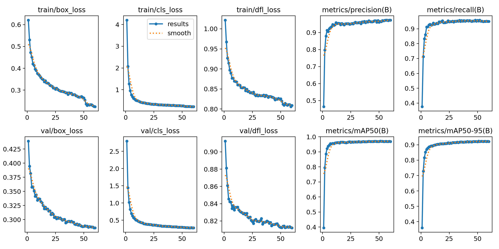

*Figure 5. Training and validation losses, precision, recall and mAP per epoch.*

## 6. Results

### 6.1 Test metrics

All results are on the 250 held-out test images, which were built from test-split photos only.

| **Metric** | **Value** |
|----|----|
| mAP@0.5 | **0.981** |
| mAP@0.5:0.95 | **0.978** |
| Precision | 0.969 |
| Recall | 0.930 |
| Best F1 | 0.947 at confidence 0.77 |
| Inference time | 3.6 ms per image (Apple M4) |

mAP (mean average precision) averages, over all 73 classes, the area under the precision-recall curve. A detection counts as correct only if its ID is right and its box overlaps the true box by the IoU threshold (0.5; or averaged over 0.5 to 0.95). mAP@0.5:0.95 is almost as high as mAP@0.5, which shows the predicted boxes are very tight.

To measure the task directly ("give the ID and location of every object"), we also counted results at a confidence threshold of 0.5:

| **Outcome (941 test objects)** | **Count** | **Share** |
|----|----|----|
| Correct ID and location (IoU ≥ 0.5) | 888 | 94.4% |
| Located, but wrong ID | 22 | 2.3% |
| Missed (no detection) | 31 | 3.3% |
| False alarms (detections with no object) | 0 | |
| **Images with every object correct and no false alarm** | **201 / 250** | **80.4%** |
| Mean IoU of the correct detections | 0.994 | |

By layout, the detector is slightly better on scattered photos than on touching or concatenated ones, but the gap is small:

| **Layout** | **Test images** | **Objects** | **Object accuracy** | **Image accuracy** |
|----|----|----|----|----|
| Scatter | 138 | 504 | 95.2% | 84.1% |
| Grid | 53 | 223 | 93.7% | 73.6% |
| Collage | 59 | 214 | 93.0% | 78.0% |

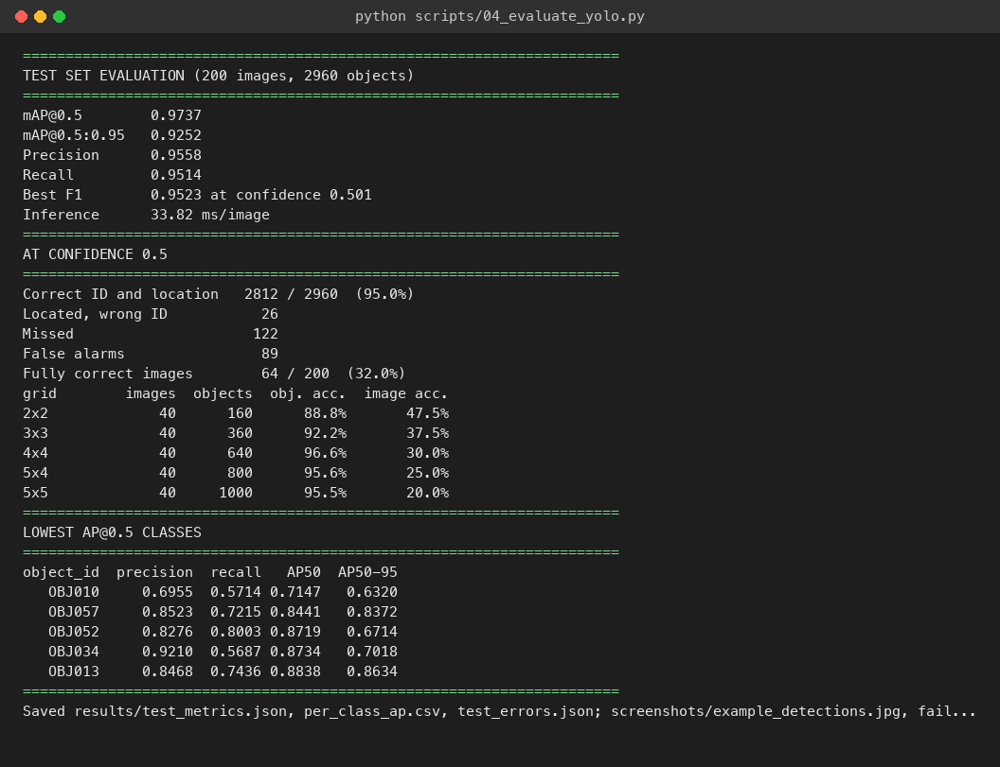

*Figure 6. Test-set evaluation output.*

### 6.2 Per-class performance

| **Tier** | **Classes** | **Count** | **Mean AP@0.5** |
|----|----|----|----|
| Excellent (AP@0.5 ≥ 0.95) | all other classes | 65 | 0.989 |
| Good (0.80–0.95) | OBJ013, OBJ061, OBJ062, OBJ034, OBJ068, OBJ065, OBJ059, OBJ014 | 8 | 0.917 |
| Needs improvement (< 0.80) | none | 0 | |

| **Lowest AP@0.5** | **Precision** | **Recall** | **AP@0.5** |
|----|----|----|----|
| OBJ013 | 0.816 | 0.692 | 0.864 |
| OBJ061 | 0.891 | 0.750 | 0.885 |
| OBJ062 | 0.893 | 0.846 | 0.907 |
| OBJ034 | 0.977 | 0.692 | 0.910 |
| OBJ068 | 0.911 | 0.769 | 0.933 |

### 6.3 Evaluation curves and confusion matrix

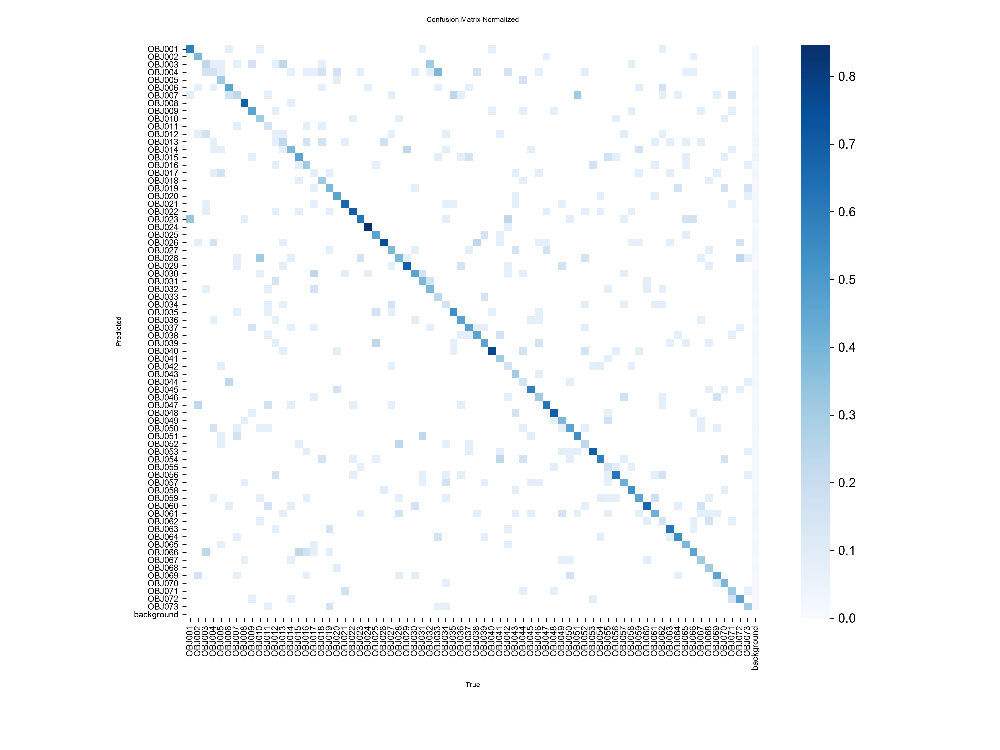

*Figure 7. Normalized confusion matrix on the test set. The diagonal is close to 1 for almost every class; the few off-diagonal entries are the confusions listed in Section 7.*

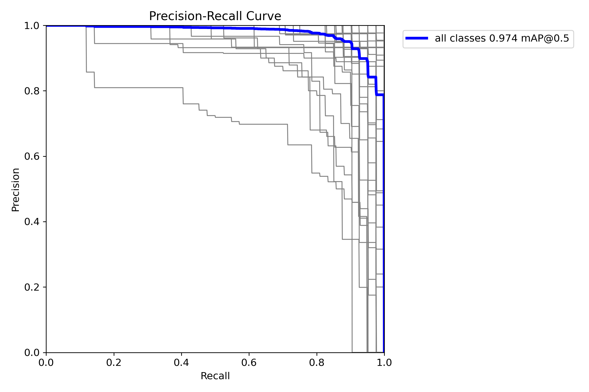

*Figure 8. Precision-recall curve. Precision stays high across almost the whole recall range, giving an area (mAP@0.5) of 0.981 over all classes.*

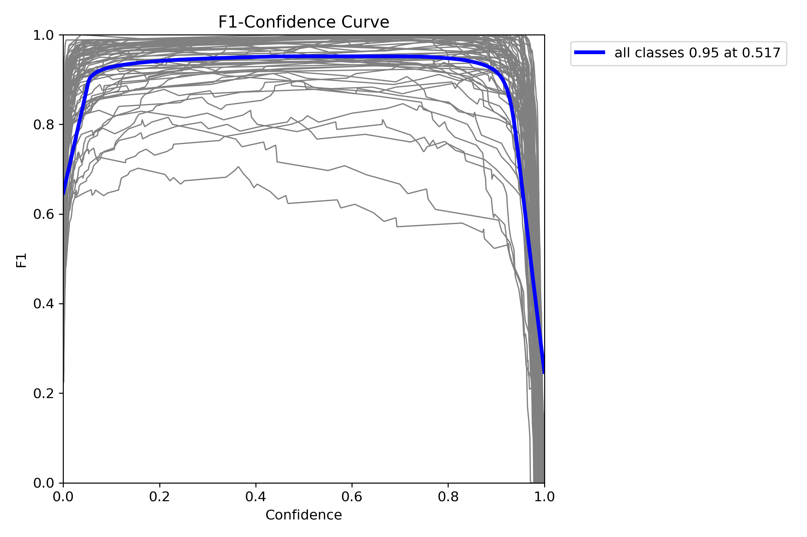

*Figure 9. F1 against confidence threshold. The best F1 (about 0.95) is at confidence 0.77–0.78; F1 stays above 0.9 for thresholds from about 0.06 to 0.95, so the result is not sensitive to the exact threshold. Grey lines are individual classes.*

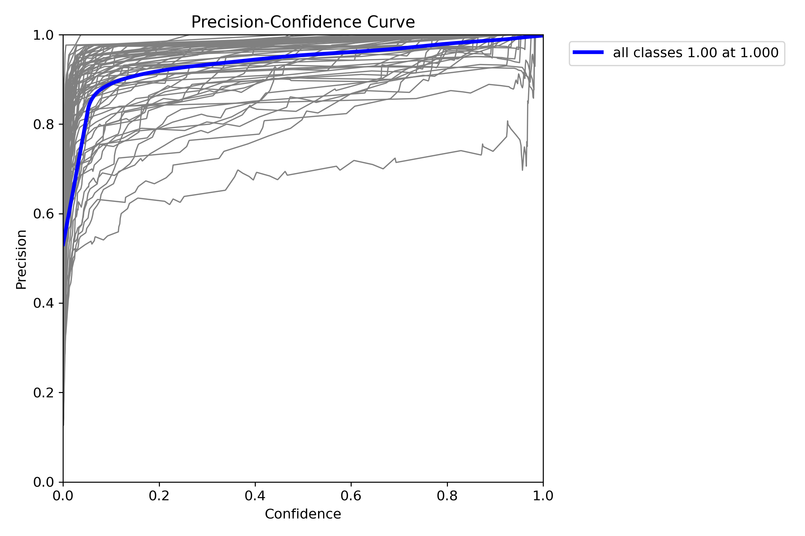

*Figure 10. Precision against confidence: precision rises with the threshold and reaches 1.0 at the highest confidences.*

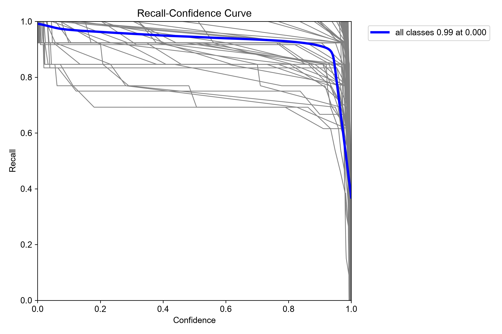

*Figure 11. Recall against confidence: recall is 0.99 at the lowest threshold, declines slowly, and drops steeply only above about 0.93.*

### 6.4 Example detections

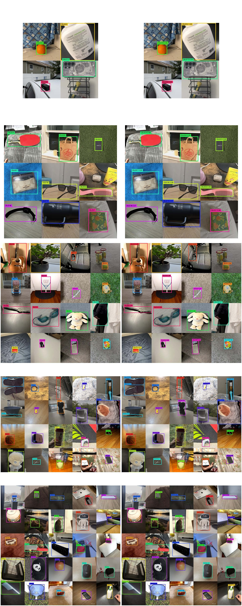

*Figure 12. Six test images: two scatter, two grid and two collage. In each pair, the left image shows the ground truth and the right image the model's prediction with confidence. All objects are found with the correct ID.*

### 6.5 Detection pipeline output

Given an image, scripts/04_detect.py prints the Object ID, confidence and box of every object, saves an annotated copy, and, when a label file exists, marks each detection correct or wrong. On the first 10 test images:

| **Metric** | **Value** |
|----|----|
| Images processed | 10 |
| Objects detected | 37 |
| Average objects per image | 3.7 |
| Average confidence | 97.1% |
| Correct detections | 36 of 37 |
| Missed objects | 1 of 37 |

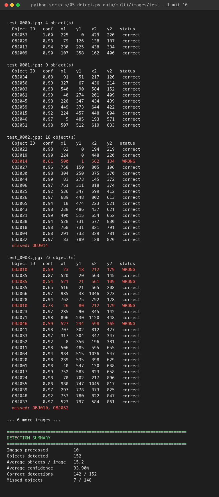

*Figure 13. Detection script output on 10 test images, with each object's ID, confidence, box (x1, y1, x2, y2 in pixels) and status.*

## 7. Error analysis

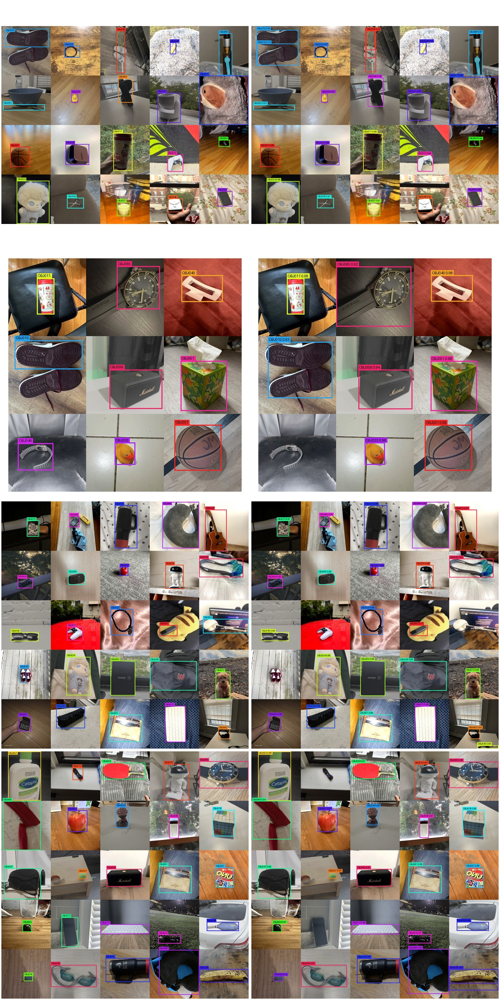

*Figure 14. The four test images with the most errors (ground truth left, prediction right).*

The errors fall into three groups:

- **Overlapping photos in collages.** When a photo is partly covered by its neighbour, the model sometimes misses it or gives it the wrong ID (top left of Figure 14: the partly covered OBJ010 is predicted as OBJ026, and OBJ005 as OBJ003).
- **Wrong ID between similar photos.** The most frequent confusion is OBJ061 → OBJ059 (2 times); all other confusions happen once. OBJ061 and OBJ059 photos are often wide room scenes where the object is a small part of the frame, so the model has little object detail to use.
- **Missed objects.** 31 objects get no detection above 0.5 confidence, most often OBJ034, OBJ057, OBJ012 and OBJ044 (3 each). Most are photos where the object is small in a wide scene, or where the photo also contains other items such as clothes, cables or appliances, which makes it look unlike that class's typical photo.

## 8. Limitations

- **Boxes cover the photo, not the object.** The labels come from where each photo was pasted, so the model learns to locate the photo that contains the object. In many source photos the object fills only part of the frame, so the box is larger than the object itself. Tighter boxes would need object-level annotation of the single-object photos.
- **Synthetic scenes.** Test images are built the same way as training images, so they share the pasted-rectangle look. On real photos with several objects in one scene (different lighting, occlusion, no rectangular borders), accuracy will be lower.
- **Same-session photos.** Test photos were taken by the same students in the same sessions as the training photos, which makes the test easier than truly new photos.
- **Small per-class test counts.** Each class has 12 to 14 test instances, so one error changes a class's AP noticeably.

## 9. Conclusion

We built a 1,700-image multi-object dataset from the 73-object class collection, with automatically generated YOLO labels, three layouts, and verified separation of source photos between train, validation and test. A COCO-pretrained YOLOv8s fine-tuned on this data reaches mAP@0.5 = 0.981 on held-out test images and correctly identifies and locates 94.4% of the objects, with no false alarms, at about 3.6 ms per image. Given a multi-object image, the model reports the Object ID, confidence and bounding box of every object, which is the capability needed for the Week 3 demonstration.

**Key takeaways:**

- **Transfer learning works with little data:** starting from COCO weights, the detector passes 0.94 validation mAP@0.5 within 10 epochs, with only about 61 training instances per class.
- **Balanced, leak-free data:** cycling through all classes gives 61–62 training instances per class, and the split check guarantees that no test photo, or near-duplicate of one, was seen in training.
- **Layout variety pays off:** compared with our first run without the collage layout (mAP@0.5 0.973, image accuracy 78.0%, 2 false alarms on its own 250-image test set), the final model scores 0.981, 80.4% and 0 false alarms, while its test set is harder because a quarter of it has touching or overlapping objects. The two test sets differ, so this comparison is indicative rather than exact.
- **Remaining errors are hard photos:** 65 of 73 classes have AP@0.5 ≥ 0.95, and no class is below 0.80. Most errors are partly covered photos or wide scenes where the object is small.

## 10. Deliverables

| **File** | **Purpose** |
|----|----|
| scripts/00_prepare_singles.py | Clean, deduplicate and split the full Drive download into data/singles/ |
| scripts/01_make_multi_object.py | Generate the multi-object images, YOLO labels and manifest; split and label checks |
| scripts/02_train_yolo.py | Fine-tune pretrained YOLOv8s |
| scripts/03_evaluate_yolo.py | Test metrics, per-layout accuracy, class tiers, curves, example detections and failure cases |
| scripts/04_detect.py | Detect, identify and locate the objects in new images |
| scripts/05_export_web.py | Export the models to ONNX (checked against PyTorch) and the results for the demo website |
| scripts/06_report_figures.py | Render the console outputs used as figures in this report |
| scripts/detector/ | Shared code: composition, evaluation, drawing |
| data/singles/ | 73-class single-object split and background photos |
| data/multi/ | 1,700 multi-object images, YOLO labels, data.yaml, manifest.csv |
| models/yolov8s_best.pt | Trained detector (best validation epoch) |
| runs/ | Ultralytics training and evaluation logs and plots |
| results/ | test_metrics.json, per_class_ap.csv, test_errors.json, test_per_image.csv, dataset_stats.json, curves and confusion matrix |
