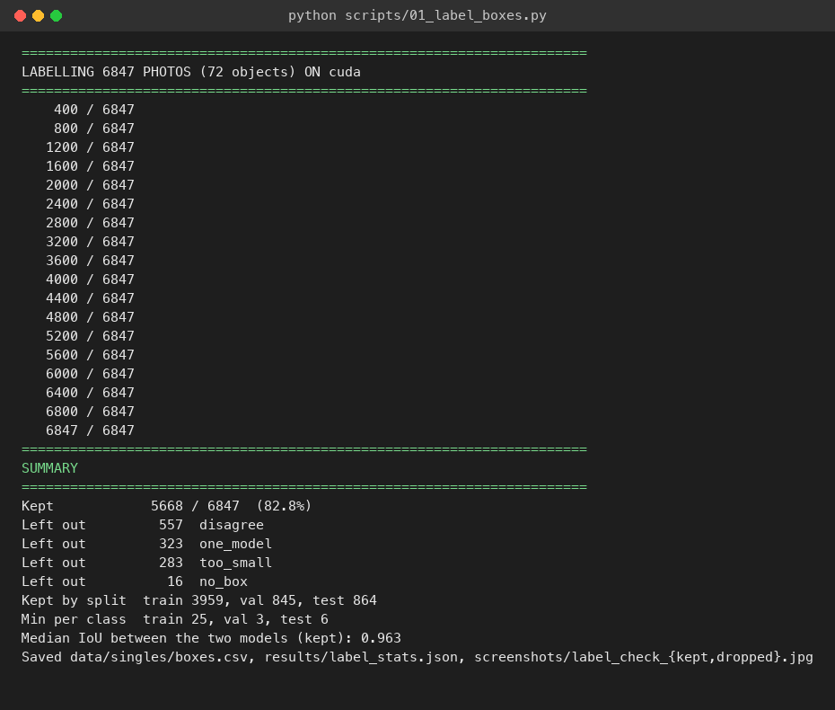
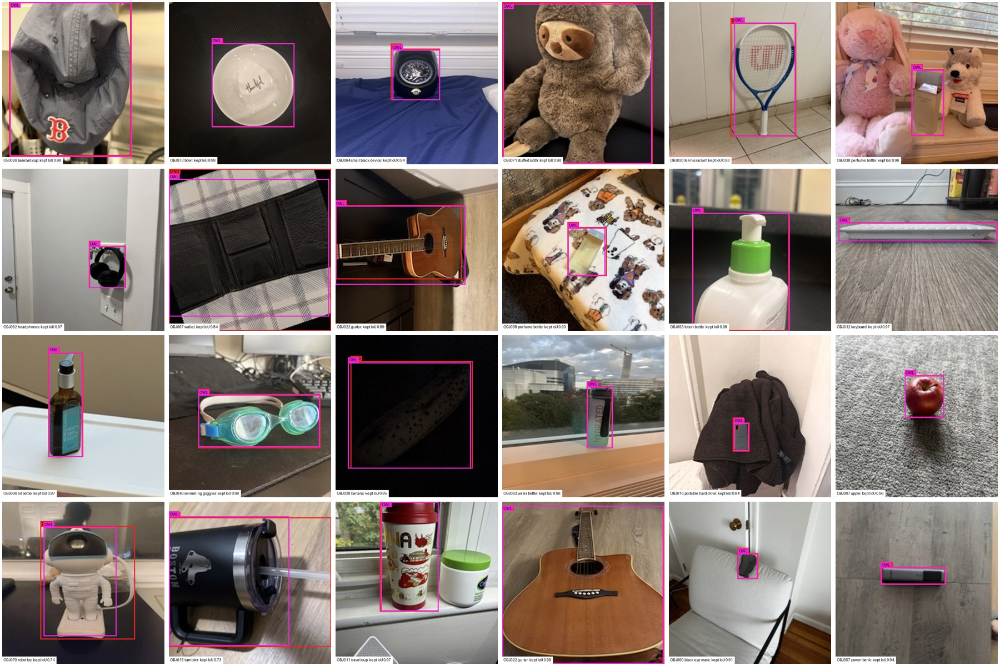
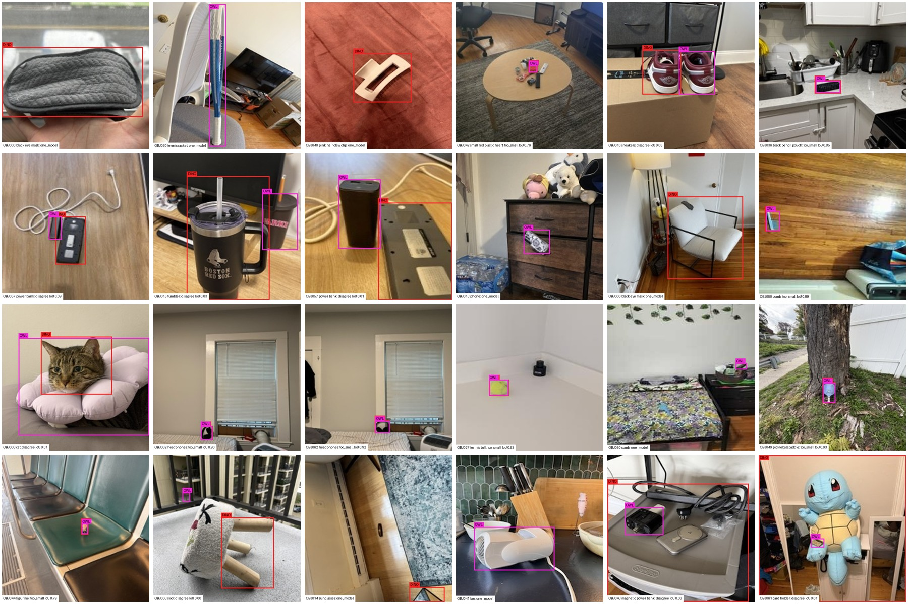

# Project Report – Object Detection and Location (Milestone 2)

**Northeastern University, IE 7615 – Discriminative Deep Learning, Fall 2026, October 10, 2026**

**Group 1**

| Name | NUID |
|---|---|
| Anshuman Singh | 002590892 |
| Rohan Prakash Krishna Prakash | 002317798 |
| Sree Ramya Pasala | 002301508 |

PDF version: [Milestone2_Report.pdf](Milestone2_Report.pdf)

## Repository

GitHub: <https://github.com/anshuman-dataverse/discriminative-deep-learning-project>

Code, trained model and results are in the milestone2/ folder of the repository (image data stays on Google Drive). This report explains how the multi-object images and labels were built, reports the detector's performance, and shows example detections.

## 1. Summary

We built **1,400 multi-object images** (1,000 train / 200 validation / 200 test) by concatenating randomly selected 224×224 single-object photos from the shared class dataset into grids of 2×2, 3×3, 4×4, 5×4 and 5×5 photos, so each image holds 4 to 25 objects (20,720 objects in total). The dataset covers **72 objects** (final Object IDs; OBJ054 excluded as instructed). The bounding box of the object inside every photo was produced automatically by two open-vocabulary detectors, **Grounding DINO** and **OWLv2**, and a photo was used only when the two agreed. Duplicate photos were removed before splitting, and no source photo appears in more than one split. We then fine-tuned a COCO-pretrained **YOLOv8s** detector on these images at an input size of 1120 with transfer learning.

On the 200 held-out test images (2,960 objects) the detector reaches **mAP@0.5 = 0.974** and **mAP@0.5:0.95 = 0.925**. At a confidence threshold of 0.5, **95.0% of all objects** are found with the correct Object ID and location, and the mean IoU of these correct boxes with the ground truth is 0.959. Because a test image holds up to 25 objects, a single miss makes the whole image count as wrong: 32% of test images have every object correct. Inference takes about 34 ms per 1120-pixel image on a Tesla T4 GPU.

## 2. Objective

Given an image that contains several objects, the model must report the **Object ID and location** of every object. The milestone requires (1) at least 100 multi-object images built by combining randomly selected single-object images, with no source image in more than one split, (2) a YOLOv8 model trained to detect the objects, and (3) a model that outputs the ID and bounding box of each object in a test image.

The class clarifications for this milestone set the following specification, which we followed:

- Multi-object images are grids of 224×224 photos from 2×2 (448×448) up to 5×5 (1120×1120); the 5×4 grid is 1120×896.
- Training uses imgsz = 1120 and batch size 8.
- Bounding boxes come from open-vocabulary detectors run on the single-object photos, cross-checked between two models.
- OBJ054 is excluded; duplicate photos are removed before the train/validation/test split.

## 3. Single-object source data

### 3.1 Final dataset and Object IDs

We used the complete shared Drive folder: 73 folders named images_OBJ001 to images_OBJ073, matching the final Object IDs in the shared sheet, with 7,343 images in total. OBJ054 (100 photos) was excluded, which leaves **72 classes**.

### 3.2 Cleaning and split

The images were cleaned with the Milestone 1 pipeline (scripts/00_prepare_singles.py): EXIF orientation applied, resized to 224×224 RGB (3 images were not 224×224), and renamed OBJ###\_###.jpg. We found 28 groups of byte-identical files; the 28 extra copies were removed **before** splitting, so a photo and its copy can never end up in different splits. None of the duplicate groups spanned two objects. The object photos were then split **70/15/15 per class**.

| **Set** | **Object photos** | **Used to build** |
|----|----|----|
| Train | 4,819 | Training images |
| Validation | 1,014 | Validation images |
| Test | 1,014 | Test images |
| Total | 6,847 | 72 classes |

## 4. Building the labels and the multi-object images

### 4.1 Object boxes from two open-vocabulary detectors

The single-object photos have no box annotations, and many of them show the object small inside a wider scene. To get a box around the object itself rather than around the whole photo, we ran two open-vocabulary detectors on every photo (scripts/01_label_boxes.py):

- **Grounding DINO** (IDEA-Research/grounding-dino-tiny), prompted with a short name of the object, for example "basketball." (score threshold 0.2).
- **OWLv2** (google/owlv2-base-patch16-ensemble), prompted with "a photo of a basketball" (score threshold 0.03).

Each object has one hand-written prompt (scripts/detector/names.py), for example OBJ020 "pink earbuds case" or OBJ048 "magnetic power bank". Each model returns its highest-scoring box. A photo is **kept** only if:

1. both models find a box,
2. the two boxes agree, with IoU ≥ 0.5, and
3. the object is not tiny (the box covers at least 1.5% of the photo).

The label is the mean of the two boxes. Photos that fail a check are left out of the multi-object images rather than given an uncertain box.

| **Outcome (6,847 photos)** | **Photos** | **Share** |
|----|----|----|
| Kept (both models agree) | 5,668 | 82.8% |
| Left out: boxes disagree (IoU < 0.5) | 557 | 8.1% |
| Left out: only one model found the object | 323 | 4.7% |
| Left out: object too small | 283 | 4.1% |
| Left out: no box from either model | 16 | 0.2% |

For the kept photos the median IoU between the two models' boxes is 0.963, so the two detectors agree very closely. Kept photos per split: 3,959 train, 845 validation and 864 test. Every class keeps photos in every split (at least 25 train, 3 validation and 6 test photos). The classes with the most left-out photos are OBJ060 (black eye mask, 61), OBJ048 (magnetic power bank, 48) and OBJ032 (red audio interface, 42).

*Figure 1. Console output of the labelling step.*

*Figure 2. Random kept photos with the Grounding DINO box (DINO), the OWLv2 box (OWL) and their IoU.*

*Figure 3. Random left-out photos and the reason: the two models chose different items (disagree), only one model found the object (one_model), or the object was too small.*

### 4.2 Grid composition

Each multi-object image is a grid of 224×224 photos with no gaps and no background (scripts/02_make_grids.py):

| **Grid** | **Image size** | **Objects** | **Train** | **Validation** | **Test** |
|----|----|----|----|----|----|
| 2×2 | 448 × 448 | 4 | 200 | 40 | 40 |
| 3×3 | 672 × 672 | 9 | 200 | 40 | 40 |
| 4×4 | 896 × 896 | 16 | 200 | 40 | 40 |
| 5×4 | 1120 × 896 | 20 | 200 | 40 | 40 |
| 5×5 | 1120 × 1120 | 25 | 200 | 40 | 40 |

1. **Grid size:** the five sizes take turns, so each one makes up a fifth of every split.
2. **Object selection:** objects are drawn from a shuffled queue that cycles through every class, so all 72 objects appear about equally often, and no object appears twice in one image. Within a class, photos are drawn from a shuffled queue without replacement until all have been used, so every kept photo is used before any is repeated.
3. **Augmentation:** each photo is independently flipped horizontally (50%, the box is mirrored with it) and given random brightness, contrast and saturation changes (±25%).
4. **Label:** the photo's object box is shifted by the photo's position in the grid and written in YOLO format.

The generator uses a fixed seed per split, so the same box table always gives the same images.

### 4.3 Labels

Each image gets a YOLO label file with one line per object:

    class_index  x_center  y_center  width  height

The coordinates are normalized to 0–1 by that image's own width and height. The class index maps to the Object ID through data.yaml (index 0 = OBJ001 … index 71 = OBJ073; OBJ054 has no index). A manifest file (data/multi/manifest.csv) records, for every object, the image, split, grid, source photo, Object ID and box in pixels.

### 4.4 Split integrity and label validation

Train images are built only from training photos, and likewise for validation and test. After generation, the script runs two checks and stops with an error if either fails:

- **No leakage:** every source photo used is checked both by file path and by a near-duplicate image fingerprint. **0 photos** appear in more than one split.
- **Valid labels:** every image has a label file and vice versa, every image has one of the five grid sizes, the number of boxes matches the grid, every line has 5 values, the class index is in range, and every box lies inside the image with positive size. **20,720 boxes in 1,400 images were checked, 0 invalid.**

| **Split** | **Images** | **Objects** | **Unique source photos** | **Min. objects per class** |
|----|----|----|----|----|
| Train | 1,000 | 14,800 | 3,959 | 201 |
| Validation | 200 | 2,960 | 845 | 39 |
| Test | 200 | 2,960 | 864 | 39 |
| Total | 1,400 | 20,720 | 5,668 | |

Since the grids need more objects than there are kept photos, each training photo appears in about 3.7 training images, each time at a different grid position and with its own flip and colour change.

*Figure 4. Console output of the grid generator, including the split and label checks.*

*Figure 5. Generated training images of each grid size with their labels.*

### 4.5 Label distribution

Every class has at least 201 training instances (about 205 on average), so the training set is balanced across all 72 objects. Box centres follow the grid cells, and box sizes vary widely because the object fills a different part of each photo (on average the box covers 26% of its photo).

*Figure 6. Training label distribution: instances per class (top left), box shapes (top right), box centres (bottom left) and box width against height (bottom right).*

## 5. Model and training

### 5.1 YOLOv8s architecture

YOLOv8 is a one-stage detector: a convolutional backbone (CSPDarknet with C2f blocks) extracts features, a feature-pyramid neck combines them at three scales, and an anchor-free decoupled head predicts a box and class scores at every location. We used the small variant, YOLOv8s, which balances accuracy and speed.

| **Specification** | **Value** |
|----|----|
| Architecture | YOLOv8s (small) |
| Input resolution | 1120 × 1120 (letterboxed) |
| Total parameters | 11,163,464 (11,153,448 after layer fusion) |
| GFLOPs | 28.8 at 640 (28.6 fused); about 87.5 at 1120 |
| Layers | 129 (72 after fusion) |
| Detection heads | 3 scales (strides 8, 16, 32 for small, medium, large objects) |

At 1120 a 224-pixel photo stays at its original resolution, so even the 25 photos of a 5×5 grid keep all their detail.

### 5.2 Transfer learning

- **Pretrained weights:** COCO (80 classes), downloaded from Ultralytics (yolov8s.pt).
- **New head:** the 80-class head was replaced by a **72-class** head (Ultralytics: "Overriding model.yaml nc=80 with nc=72"). 349 of 355 weight tensors were transferred; the 6 that were not are the class-prediction layers sized for 80 classes.
- **Fine-tuning:** the whole network (11.2M parameters) is trained, starting from the pretrained features.

### 5.3 Training configuration

| **Parameter** | **Value** | **Parameter** | **Value** |
|----|----|----|----|
| Base model | yolov8s.pt | Early-stopping patience | 15 epochs |
| Epochs | 60 (ran all 60) | Device | Tesla T4 GPU (Google Colab), mixed precision |
| Batch size | 8 | Box loss gain | 7.5 |
| Image size | 1120 | Classification loss gain | 0.5 |
| Optimizer | AdamW (auto) | DFL loss gain | 1.5 |
| Learning rate (initial) | 1.3e-4 (auto) | Warm-up | 3 epochs |
| Learning rate (final) | 0.01 × initial | IoU threshold (NMS) | 0.7 |
| Momentum | 0.9 | Weight decay | 0.0005 |
| Checkpoint | Best validation fitness | Training time | 52 minutes |

### 5.4 Augmentation applied by YOLOv8

On top of our own flip and colour augmentation (Section 4.2), Ultralytics applies these during training:

- **Mosaic:** combines 4 training images into one (probability 1.0), switched off for the last 10 epochs.
- **Horizontal flip:** 50% probability.
- **HSV colour shifts:** hue 0.015, saturation 0.7, value 0.4.
- **Random erasing:** 40% probability.
- **Scale and translation:** scale ±50%, translation ±10%.

At prediction time we use **class-agnostic non-maximum suppression**: when two boxes with different IDs overlap strongly, only the more confident one is kept.

*Figure 7. Training console output: model summary, transfer of pretrained weights, optimizer, and losses and validation metrics at selected epochs.*

### 5.5 Training progression

| **Epoch** | **Box loss** | **Cls loss** | **DFL loss** | **mAP@0.5** | **mAP@0.5:0.95** |
|----|----|----|----|----|----|
| 1 | 0.621 | 4.206 | 1.022 | 0.395 | 0.361 |
| 5 | 0.420 | 0.763 | 0.897 | 0.937 | 0.871 |
| 10 | 0.372 | 0.492 | 0.869 | 0.955 | 0.892 |
| 20 | 0.322 | 0.359 | 0.849 | 0.962 | 0.906 |
| 30 | 0.295 | 0.303 | 0.833 | 0.967 | 0.914 |
| 40 | 0.279 | 0.278 | 0.831 | 0.969 | 0.919 |
| 50 | 0.265 | 0.259 | 0.825 | 0.969 | 0.920 |
| 60 | 0.224 | 0.217 | 0.809 | 0.969 | 0.922 |

(Losses are training losses; mAP is on the validation set. The best checkpoint is epoch 51, mAP@0.5:0.95 = 0.924.)

Validation mAP@0.5 passes 0.93 by epoch 5 and then improves slowly. Validation box and classification losses keep falling to the last epoch (lowest at epochs 59 and 60), so the model is not overfitting, and early stopping never triggered. The last 10 epochs train without mosaic on plain grids, which match the test images, and the training losses drop further there.

*Figure 8. Training and validation losses, precision, recall and mAP per epoch.*

## 6. Results

### 6.1 Test metrics

All results are on the 200 held-out test images, which were built from test-split photos only.

| **Metric** | **Value** |
|----|----|
| mAP@0.5 | **0.974** |
| mAP@0.5:0.95 | **0.925** |
| Precision | 0.956 |
| Recall | 0.951 |
| Best F1 | 0.952 at confidence about 0.5 |
| Inference time | 33.8 ms per image (Tesla T4, imgsz 1120) |

mAP (mean average precision) averages, over all 72 classes, the area under the precision-recall curve. A detection counts as correct only if its ID is right and its box overlaps the true box by the IoU threshold (0.5; or averaged over 0.5 to 0.95). The gap between mAP@0.5 and mAP@0.5:0.95 is larger than with whole-photo boxes, because the boxes are now around the object itself, and object boundaries are less exact than photo edges for both the labels and the model.

To measure the task directly ("give the ID and location of every object"), we also counted results at a confidence threshold of 0.5:

| **Outcome (2,960 test objects)** | **Count** | **Share** |
|----|----|----|
| Correct ID and location (IoU ≥ 0.5) | 2,812 | 95.0% |
| Located, but wrong ID | 26 | 0.9% |
| Missed (no detection) | 122 | 4.1% |
| False alarms (detections with no object) | 89 | |
| **Images with every object correct and no false alarm** | **64 / 200** | **32.0%** |
| Mean IoU of the correct detections | 0.959 | |

Image accuracy is strict: a test image holds on average 14.8 objects, and one miss, wrong ID or extra box fails the whole image. It therefore falls as grids get larger, while object accuracy does not:

| **Grid** | **Test images** | **Objects** | **Object accuracy** | **Image accuracy** |
|----|----|----|----|----|
| 2×2 | 40 | 160 | 88.8% | 47.5% |
| 3×3 | 40 | 360 | 92.2% | 37.5% |
| 4×4 | 40 | 640 | 96.6% | 30.0% |
| 5×4 | 40 | 800 | 95.6% | 25.0% |
| 5×5 | 40 | 1,000 | 95.5% | 20.0% |

Object accuracy is lowest on the 2×2 grids. Their 4 photos are drawn at 448 pixels and scaled up 2.5 times to 1120, so objects look larger than in most training images; with only 160 objects, 18 errors are enough to lower the figure.

*Figure 9. Test-set evaluation output.*

### 6.2 Per-class performance

| **Tier** | **Classes** | **Count** | **Mean AP@0.5** |
|----|----|----|----|
| Excellent (AP@0.5 ≥ 0.95) | all other classes | 63 | 0.988 |
| Good (0.80–0.95) | OBJ057, OBJ052, OBJ034, OBJ013, OBJ068, OBJ046, OBJ014, OBJ027 | 8 | 0.894 |
| Needs improvement (< 0.80) | OBJ010 | 1 | 0.715 |

| **Lowest AP@0.5** | **Precision** | **Recall** | **AP@0.5** | **AP@0.5:0.95** |
|----|----|----|----|----|
| OBJ010 (sneakers) | 0.696 | 0.571 | 0.715 | 0.632 |
| OBJ057 (power bank) | 0.852 | 0.722 | 0.844 | 0.837 |
| OBJ052 (spoon) | 0.828 | 0.800 | 0.872 | 0.671 |
| OBJ034 (ping pong paddle) | 0.921 | 0.569 | 0.873 | 0.702 |
| OBJ013 (phone) | 0.847 | 0.744 | 0.884 | 0.863 |

### 6.3 Evaluation curves and confusion matrix

*Figure 10. Normalized confusion matrix on the test set, as produced by Ultralytics. The diagonal dominates for every class. Ultralytics builds this matrix at a lower confidence threshold than the 0.5 used for the counts above, so it also shows faint off-diagonal cells from low-confidence boxes; the last row and column (background) hold missed objects and false alarms.*

*Figure 11. Precision-recall curve, with an area (mAP@0.5) of 0.974 over all classes.*

*Figure 12. F1 against confidence threshold. The best F1 (0.95) is at a confidence of about 0.5, the threshold used for the accuracy counts above. Grey lines are individual classes.*

*Figure 13. Precision against confidence.*

*Figure 14. Recall against confidence.*

### 6.4 Example detections

*Figure 15. One test image of each grid size, from 2×2 (top) to 5×5 (bottom). In each pair, the left image shows the ground truth and the right image the model's prediction with confidence.*

### 6.5 Detection pipeline output

Given an image, scripts/05_detect.py prints the Object ID, confidence and box of every object, saves an annotated copy, and, when a label file exists, marks each detection correct or wrong. On the first 10 test images:

| **Metric** | **Value** |
|----|----|
| Images processed | 10 |
| Objects detected | 152 |
| Average objects per image | 15.2 |
| Average confidence | 93.9% |
| Correct detections | 142 of 152 |
| Missed objects | 7 of 148 |

*Figure 16. Detection script output on the first test images, with each object's ID, confidence, box (x1, y1, x2, y2 in pixels) and status, and the summary over all 10 images.*

## 7. Error analysis

*Figure 17. The test images with the most errors (ground truth left, prediction right).*

The errors fall into four groups:

- **Objects made of two parts.** OBJ010 is a pair of sneakers. Depending on the photo, the label box covers one shoe or both, so the model sometimes boxes each shoe separately or the pair as a whole (top of Figure 17). This gives both misses and extra boxes, and OBJ010 is the only class below 0.80 AP (17 of its test objects missed). Long objects can get the same treatment: in the detection output of Figure 16, the badminton racket OBJ035 in test_0003 gets three overlapping boxes of different lengths.
- **Small or thin objects in a wide scene.** Most of the 122 misses are photos where the object takes up a small part of the frame: OBJ034 (ping pong paddle, 15 missed), OBJ013 (phone, 10), OBJ052 (spoon, 9) and OBJ057 (power bank, 6).
- **Wrong ID between similar objects.** Only 26 objects get a wrong ID. The most frequent confusions are OBJ062 → OBJ046 (headphones as smartwatch), OBJ057 → OBJ005 (power bank as computer mouse) and OBJ014 → OBJ045 (two different pairs of sunglasses), 3 times each; no other confusion happens more than twice.
- **False alarms.** We sorted the extra boxes by where they fall, in a rerun of the test predictions on our own machine (93 extra boxes, against 89 on Colab, because of small numerical differences between the GPUs). About 55% lie in a part of a photo where the label has no object, for example the second shoe of OBJ010 or another item in the same photo. About 35% are on the labelled object with the right ID, but the box differs too much from the label (IoU < 0.5), so the same object also counts as missed or found twice. The other 10% are a second box with a different ID on an object that was already found. The extra boxes are most often labelled OBJ010 (15), OBJ027 and OBJ042 (7 each).

## 8. Limitations

- **Labels come from detectors, not people.** The boxes are produced by Grounding DINO and OWLv2 and kept only when the two agree, which removes most wrong boxes, but where both models make the same mistake the label is wrong. 17.2% of the photos were left out, so the hardest photos (cluttered rooms, very small objects) are under-represented in training and in testing.
- **Synthetic scenes.** Test images are grids built the same way as the training images. Real photos with several objects in one scene (overlap, shared background and lighting) would be harder.
- **Same-session photos.** Test photos were taken by the same students in the same sessions as the training photos, which makes the test easier than truly new photos.
- **Strict image accuracy.** With up to 25 objects per image, even 95% object accuracy gives only 32% fully correct images; the number reflects the size of the grids as much as the quality of the model.
- **Small per-class test counts.** Each class has 39 to 42 test objects, but these come from only 6 to 16 distinct photos per class, so a single hard photo can lower a class's AP noticeably.

## 9. Conclusion

We built a 1,400-image multi-object dataset of 2×2 to 5×5 photo grids from the 72-object class collection, with object boxes produced by two cross-checked open-vocabulary detectors, duplicates removed before splitting, and verified separation of source photos between train, validation and test. A COCO-pretrained YOLOv8s fine-tuned at an input size of 1120 reaches mAP@0.5 = 0.974 and mAP@0.5:0.95 = 0.925 on held-out test images and correctly identifies and locates 95.0% of the objects, at about 34 ms per image. Given a multi-object image, the model reports the Object ID, confidence and bounding box of every object, which is the capability needed for the Week 3 demonstration.

**Key takeaways:**

- **Two detectors are better than one for labels:** keeping a box only when Grounding DINO and OWLv2 agree (median IoU 0.963) gives tight object boxes without manual annotation, at the cost of leaving out 17% of the photos.
- **Transfer learning works with little data:** starting from COCO weights, the detector passes 0.93 validation mAP@0.5 within 5 epochs.
- **Balanced, leak-free data:** cycling through all classes gives every class at least 201 training instances, and the split check guarantees that no test photo, or near-duplicate of one, was seen in training.
- **Remaining errors are hard objects:** 63 of 72 classes have AP@0.5 ≥ 0.95. Most errors come from two-part objects (the sneakers), small objects in wide scenes, and duplicate boxes on part of an object.

## 10. Deliverables

| **File** | **Purpose** |
|----|----|
| notebooks/milestone2_colab.ipynb | Runs the whole pipeline on Google Colab, with checkpoints saved to Google Drive |
| scripts/00_prepare_singles.py | Clean, deduplicate and split the shared Drive photos into data/singles/ (OBJ054 excluded) |
| scripts/01_label_boxes.py | Object boxes from Grounding DINO and OWLv2, cross-checked; box table and label statistics |
| scripts/02_make_grids.py | Generate the grid images, YOLO labels and manifest; split and label checks |
| scripts/03_train_yolo.py | Fine-tune pretrained YOLOv8s (imgsz 1120, batch 8) |
| scripts/04_evaluate_yolo.py | Test metrics, per-grid accuracy, class tiers, curves, example detections and failure cases |
| scripts/05_detect.py | Detect, identify and locate the objects in new images |
| scripts/06_export_web.py | Export the models to ONNX (checked against PyTorch) and the results for the demo website |
| scripts/07_report_figures.py | Render the console outputs used as figures in this report |
| scripts/detector/ | Shared code: box labelling, grid composition, evaluation, drawing, object prompts |
| models/yolov8s_best.pt | Trained detector (best validation epoch) |
| runs/ | Console logs and Ultralytics training and evaluation plots |
| results/ | test_metrics.json, per_class_ap.csv, test_errors.json, test_per_image.csv, dataset_stats.json, label_stats.json, curves and confusion matrix |
